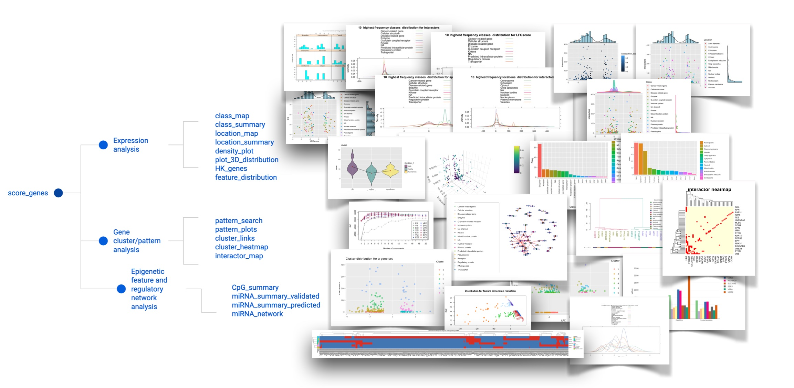

# OmicInt
OmicInt Package

## 1. Package Overview

*OmicInt* is an R package developed for an in-depth exploration of significantly changed genes, gene expression patterns, and associated epigenetic features as well as miRNA environment. The package helps to assess gene clusters based on their known interactors (proteome level) using several different resources, e.g. UniProt [1] and STRINGdb [2]. Moreover, *OmicInt* provides an easy Gaussian mixture modelling (GMM) [3,4] pipeline for an integrative analysis that can be used by a non-expert to explore gene expression data. Specifically, the package builds on a previously developed method to explore gene networks using significantly changed genes, their log-fold-change values (LFC), and the predicted interactome complexity [5]. This approach can aid in studying specific gene networks, understanding cellular perturbation events, and exploring interactions that might not be easily detectable otherwise [5]. To this end, the package offers many different utilities to help researchers quickly explore their data in a user-friendly way where machine learning is made easily accessible to non-experts (Fig.1).

## 2. Package functions

## 3. Package comments

The package has the following dependencies: ggplot2,mclust,gtools,tidyr,pheatmap, viridis, dplyr,stringr,reshape2,plotly, methods,lattice, stats, knitr, rmarkdown, RColorBrewer, igraph, ggExtra, dendextend,STRINGdb, utils, graphics, RCurl, tidyselect.

Please note that plotly is used to build interactive plots which will appear on the Viewer tab in RStudio.

Version: v1.1.5

Github pages: https://github.com/Algorithm379/Packages/ and https://github.com/AusteKan/OmicInt

Inquiries: info [at] algorithm379 [.] com

## 4.References

1. 	UniProt [Internet]. [cited 2020 Dec 7]. Available from: https://www.uniprot.org/

2. 	Szklarczyk D, Gable AL, Lyon D, Junge A, Wyder S, Huerta-Cepas J, et al. STRING v11: Protein-protein association networks with increased coverage, supporting functional discovery in genome-wide experimental datasets. Nucleic Acids Res. 2019 Jan 8;47(D1):D607–13.

3. 	Kanapeckaitė A, Burokienė N. Insights into therapeutic targets and biomarkers using integrated multi-’omics’ approaches for dilated and ischemic cardiomyopathies. Integr Biol (Camb) [Internet]. 2021 May 1 [cited 2021 Sep 21];13(5):121–37. Available from: https://pubmed.ncbi.nlm.nih.gov/33969404/

4. 	Reynolds D. Gaussian Mixture Models. In: Encyclopedia of Biometrics [Internet]. Boston, MA: Springer US; 2009 [cited 2020 Dec 14]. p. 659–63. Available from: http://link.springer.com/10.1007/978-0-387-73003-5_196

5. 	DisGeNET - a database of gene-disease associations [Internet]. [cited 2021 Aug 18]. Available from: https://www.disgenet.org/

